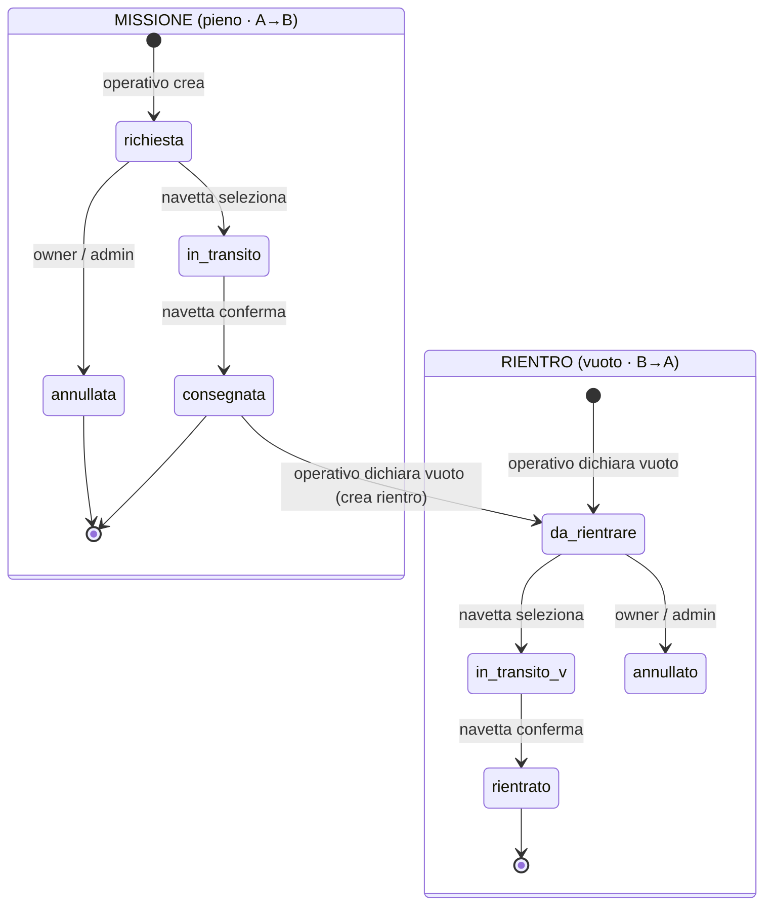

# Gestione Movimentatori — CalVergiate

Web app per la prenotazione di missioni di movimentazione merce dal magazzino alle
linee di produzione, con gestione del rientro dei vuoti. Modellata sulla struttura
di **CalPnt** (Firebase/Firestore, ruoli, login via username, GitHub Pages, palette
Logos) ma con dominio riscritto.

## Ruoli

| Ruolo | Cosa fa |
|---|---|
| **Operativo** | Crea le missioni (pieno: magazzino → linea). Dichiara i vuoti sulle consegne arrivate (genera il rientro). Annulla le proprie missioni/vuoti finché sono in attesa. |
| **Autista** (navetta) | Vede un'unica coda con pieni e vuoti, seleziona cosa svolgere, conferma consegna/rientro. Nessuna assegnazione automatica. |
| **Amministrativo** | Sola lettura: storico e statistiche. |
| **Amministratore** | Tutto + anagrafiche (elementi, ubicazioni) e gestione utenti. |

## Ciclo delle missioni



L'annullamento è possibile **solo in attesa** (`richiesta` / `da_rientrare`), mai in transito.

## Modello dati (Firestore)

- **`elementi/{id}`** — `codice`, `descrizione`, `attivo`, `createdAt`
- **`ubicazioni/{id}`** — `nome`, `tipo` (`magazzino` | `linea`), `attivo`, `createdAt`
- **`missioni/{id}`** — `elementoId/Codice`, `origineId/Nome`, `destinazioneId/Nome`, `stato` (`richiesta`→`in_transito`→`consegnata`, `annullata`), `navettaId/Nome`, `ownerUid/Nome`, `vuotoId`, timestamp
- **`rientri/{id}`** — `missioneId` (collegamento), stesse coordinate invertite, `stato` (`da_rientrare`→`in_transito`→`rientrato`, `annullato`), `navettaId/Nome`, `ownerUid/Nome`, timestamp
- **`users/{uid}`** — `name`, `email`, `username`, `role`
- **`usernames/{username}`** — `email` (lookup per login)
- **`history/{id}`** — log delle azioni

Il collegamento pieno↔vuoto è bidirezionale: `missioni.vuotoId` ↔ `rientri.missioneId`.
Nomi e codici sono denormalizzati sulle missioni: rinominare un'anagrafica non rompe le missioni già create.

## Struttura file

```
index.html            UI unica responsive
app.js                entry: Firebase, auth, listener, routing per ruolo
firebase-config.js    ⚠️ INCOLLARE LA apiKey
shared-utils.js       utility (logHistory, date, toast, esc)
styles.css            palette Logos
sw.js                 service worker (cache azzerata a ogni activate)
firestore.rules       regole di sicurezza
modules/
  operativo.js        crea missione, dichiara vuoto, annulla
  navetta.js          coda unica, presa in carico, conferma
  anagrafiche.js      CRUD elementi + ubicazioni
  admin.js            storico, statistiche, utenti
.github/workflows/deploy.yml   deploy GitHub Pages + cache-busting
```

Nessun `assemble.py`: import ES nativi. Il cache-busting `?v=` è applicato al deploy
solo su `index.html` e `app.js`; `sw.js` garantisce comunque file sempre freschi.

## Setup

1. **Firebase** → console → progetto `gestione-movimentatori-calver`:
   - Authentication → abilita **Email/Password**
   - Firestore Database → crea (region `europe-west`)
   - incolla le **regole** da `firestore.rules`
2. **`firebase-config.js`** → incolla la `apiKey` (Impostazioni progetto → app web).
3. **Primo amministratore** (una tantum, la registrazione self-service non esiste):
   - Authentication → Aggiungi utente (email + password) → copia l'UID
   - Firestore → crea `users/{UID}` = `{ name, email, username, role: "amministratore" }`
   - crea `usernames/{username}` = `{ email }`
   - da qui in poi gli altri utenti si creano dall'app (scheda Utenti).
4. **Deploy** → repo GitHub → Settings → Pages → Source: GitHub Actions. Ogni push su
   `main` pubblica e rigenera i `?v=`.

## Note sulle regole
Le regole sono un punto di partenza pragmatico per uno strumento interno (gli utenti
autenticati possono creare/aggiornare missioni e rientri). Si possono stringere in
seguito (es. limitare l'annullamento all'owner via regole, oltre che via UI).
